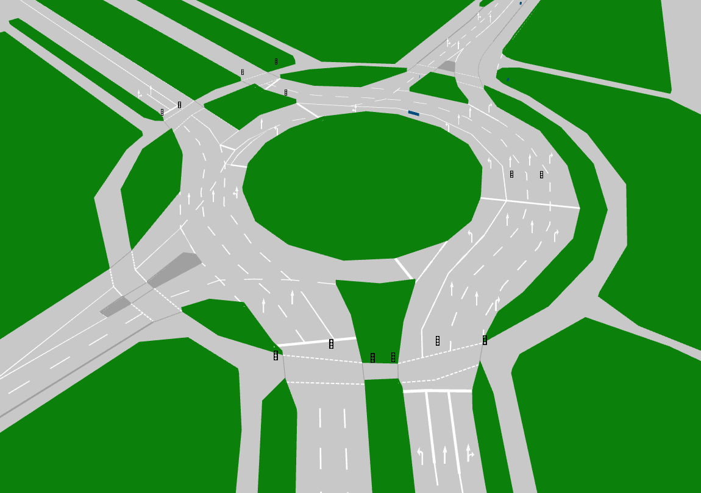

# Lanelet2

## Overview

Lanelet2 is a C++ library with ROS support for handling map data in the context of automated driving. It is designed to utilize high-definition map data in order to efficiently handle the challenges posed to a vehicle in complex traffic scenarios. Flexibility and extensibility are one of the core prinicples to handle the upcoming challenges of future maps.

Features:
- *2D and 3D* support
- *Consistent modification*. If on point is modified, all owning objects see the change
- Supports **lane changes**, routing through areas, etc
- *Separated routing* for pedestrians, vehicles, bikes, etc.
- Many *constomization points* to add new traffic rules, routing costs, parsers, etc.
- *ROS interface* for communicating parts of a lanelet map via ROS
- *Simple convenience functions* for common tasks when handling maps
- *Accurate Projection* between the lan/lon world and local coordinates
- *IO Interface* for reading and writing e.g. _osm_ data formats
- *Python2* bindings for the whole C++ interface
- *Boost Geometry* support for all thinkable kinds of geometry calculations on map primitives
- Released under the [**BSD 3-Clause license**](LICENSE)



Lanelet2 is the predecessor of the old [liblanelet](https://github.com/phbender/liblanelet/tree/master/libLanelet) that was developed in 2013. If know Lanelet1, you might be interested in [reading this](lanelet2_core/doc/Lanelet1Compability.md).

## Documentation

You can find more documentation in the individual packages and in docxygen comments. Here is an overview on the most imporant topics:
- [Here](lanelet2_core/doc/LaneletPrimitives.md) is more information on the basic primitives that make up a Lanelet2 map
- [Read here](lanelet2_core/doc/Architecture.md) for a primer on the **software architecture** of lanelet2.
- There is also some [documentation](lanelet2_core/doc/GeometryPrimer.md) on the geometry calculations you can do with lanelet2 primitives.
- If you are interested in Lanelet2's **projections**, you will find more [here](lanelet2_projection/doc/Map_Projections_Coordinate_Systems.md)
- To get more information on how to create valid maps, see [here](lanelet2_projection/doc/Mapping.md)

## Installation
Lanelet2 uses Catkin for building and is targeted towards Linux.

### Dependencies
* `Boost` (from 1.56)
* `eigen`
* [`mrt_cmake_modules`](https://github.com/KIT-MRT/mrt_cmake_modules), a CMake helper library
* `pugixml` (for lanelet2_io)
* `boost-python/python2` (for lanelet2_python)
* `geographiclib` (for lanelet2_projection)
* `ROS` (for lanelet2_interface_ros and lanelet2_msgs_ros)

For Ubuntu (assuming you have ROS [installed](http://wiki.ros.org/ROS/Installation):
```shell
sudo apt-get install catkin-tools libboost-dev libeigen3-dev libgeographic-dev libpython-dev libboost-python-dev
```

### Building
As usual with Catkin, you have to crate a workspace and clone all required packages there. Then you can build:
```shell
mkdir catkin_ws
cd catkin_ws
catkin init
git clone https://github.com/KIT-MRT/mrt_cmake_modules.git
git clone https://github.com/fzi-forschungszentrum-informatik/lanelet2.git
catkin build
```


## Examples
Examples common use cases in both C++ and Python can be found [here](lanelet2_examples/README.md).

## Packages
* **lanelet2** is the meta-package for the whole lanelet2 framework
* **lanelet2_core** implements the basic library with all the primitives, geometry calculations and the LanletMap object
* **lanelet2_io** is responsible for reading and writing lanelet maps
* **lanelet2_traffic_rules** provides support to interpret the traffic rules encoded in a map
* **lanelet2_projection** for projecting maps from WGS84 (lat/lon) to local metric coordiantes
* **lanelet2_routing** implements the routing graph for routing or reachable set or queries as well as collision checking
* **lanelet2_maps** provides example maps and functionality to visualise and modify them easily in JOSM
* **lanelet2_python** implements the python interface for lanelet2

## Citation

If you are using Lanelet2 for scientific research, we would be peased if you would cite our publication:
```bibtex
@inproceedings {
  author   = {Poggenhans, Fabian and Pauls, Jan-Hendrik and Janosovits, Johannes and Orf, Stefan and Naumann, Maximilian and Kuhnt, Florian and Mayr, Matthias},
  booktitle = {2018 IEEE 21th International Conference on Intelligent Transportation Systems (ITSC)},
  title     = {{Lanelet2: A High-Definition Map Framework for the Future of Automated Driving}},
  year      = {2018}
}
```


